# Project Showcase — AI-Powered Resume Analysis & Job Matching System

> **Developed by Ankitha Ramesh**
> 📄 [Research Paper (DOI)](https://www.doi.org/10.59256/ijsreat.20250506017) · 🔙 [Back to README](./README.md)

This document contains the full visual walkthrough of the application — UI screenshots, workflow demonstrations, and ATS report samples. Source code and setup instructions are in the main [README.md](./README.md).

---

## Table of Contents

1. [Home Page & Landing](#1-home-page--landing)
2. [Authentication](#2-authentication)
3. [Recruiter Dashboard](#3-recruiter-dashboard)
4. [Job Posting](#4-job-posting)
5. [Applicant Dashboard & Profile](#5-applicant-dashboard--profile)
6. [Job Discovery & Application](#6-job-discovery--application)
7. [ATS Resume Analysis](#7-ats-resume-analysis)
8. [Notifications System](#8-notifications-system)
9. [Messaging System](#9-messaging-system)
10. [ATS Reports](#10-ats-reports)

---

## 1. Home Page & Landing

The landing page introduces the platform with role-based entry points for recruiters and applicants.

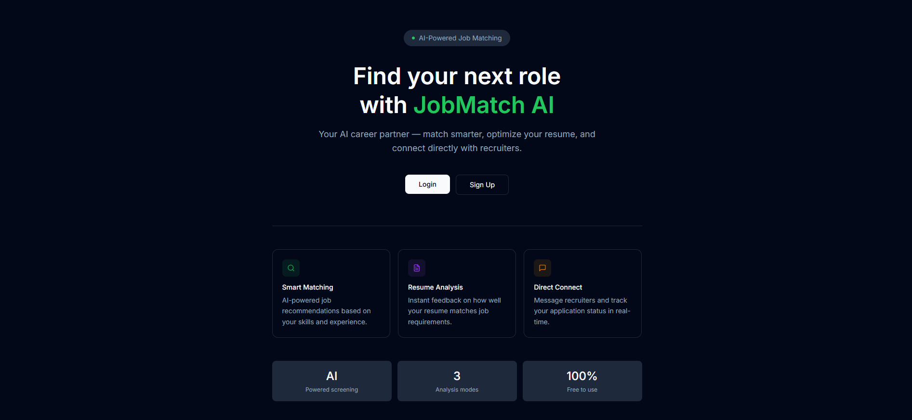

> *Modern, responsive landing with clear call-to-actions for both user roles.*

---

## 2. Authentication

Secure registration and login with role selection (Recruiter / Applicant). JWT tokens are issued on successful authentication.

**Registration:**
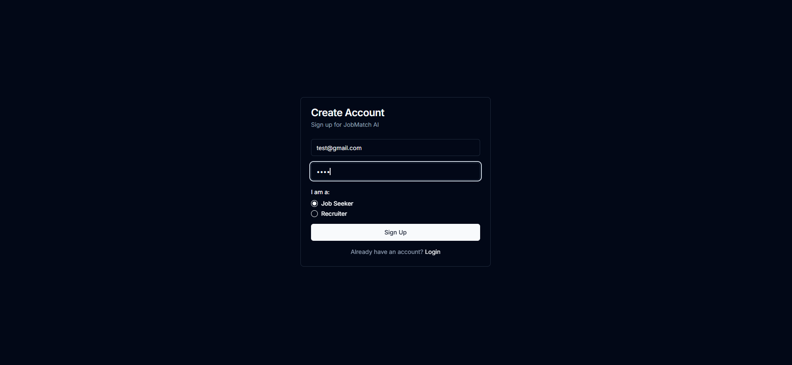

**Login:**
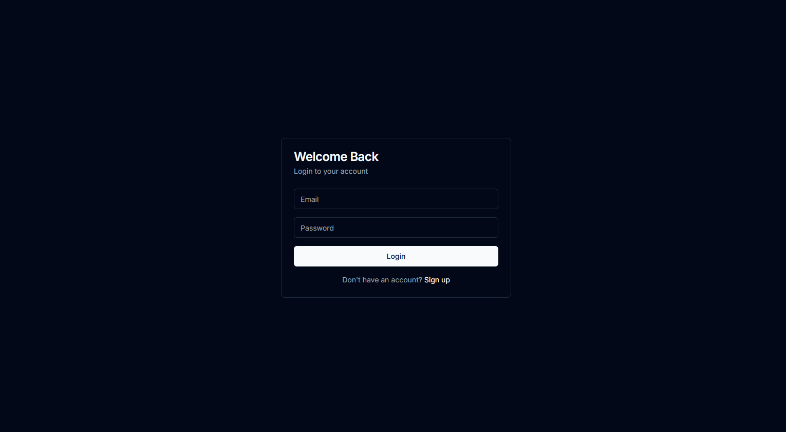

> *Role-based auth ensures recruiters and applicants see entirely different dashboards and data.*

---

## 3. Recruiter Dashboard

The recruiter home screen provides an overview of posted jobs, incoming applications, and AI match scores. Each candidate is ranked by AI-computed compatibility score with expandable analysis details.

**Main Dashboard:**
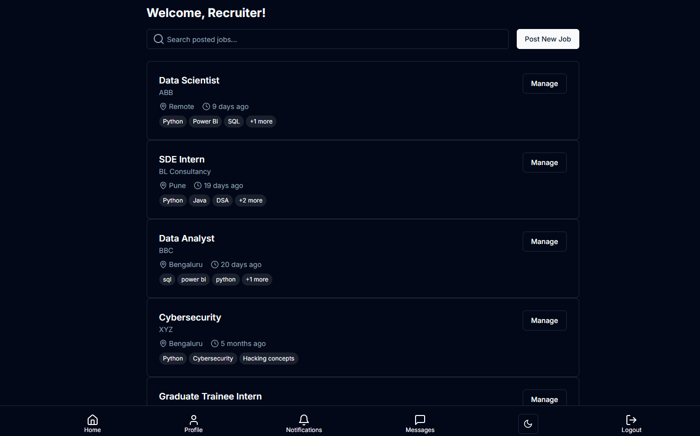

**Application Review Panel:**

The review panel shows each candidate ranked by compatibility score, with full AI analysis visible inline.

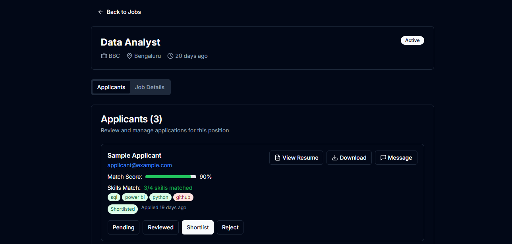

> *Recruiters can accept or reject applications in one click. Automated, personalized feedback is sent to the applicant immediately.*

---

## 4. Job Posting

Recruiters create job listings with a full description and a weighted skills list. Skill weights directly influence the AI compatibility scoring — signalling which qualifications are critical vs. nice-to-have.

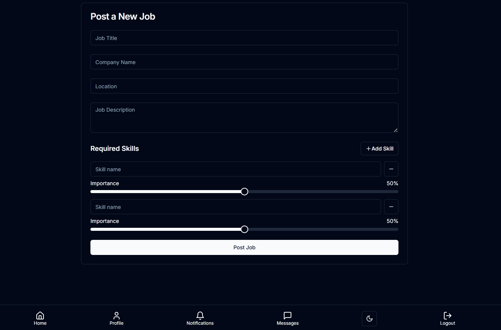

> *The AI respects skill weights when ranking candidates, so a required skill like "React" outweighs a preferred one like "GraphQL".*

---

## 5. Applicant Dashboard & Profile

Applicants see a personalized dashboard summarizing their application activity, and a profile page to manage their details.

**Dashboard:**
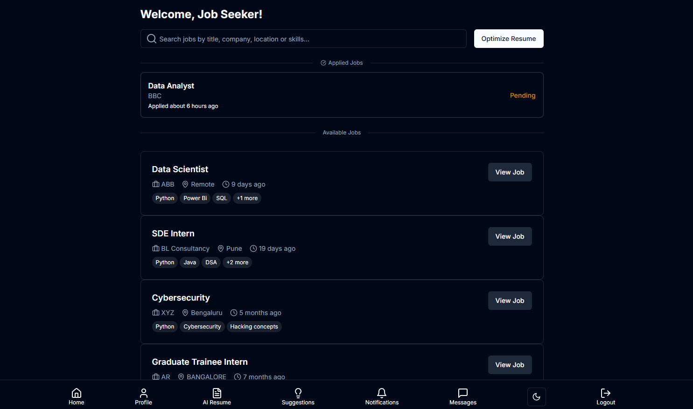

**Profile:**
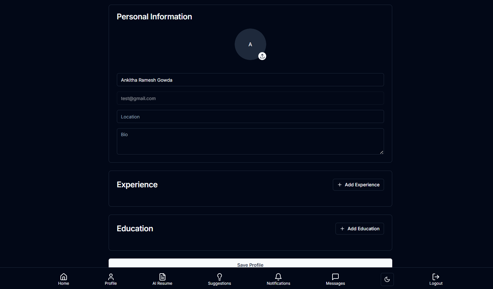

---

## 6. Job Discovery & Application

Applicants browse active job listings and apply with resume upload in one seamless flow. The application form accepts PDF or DOCX resumes — ATS analysis runs automatically on submission.

**Apply Flow:**
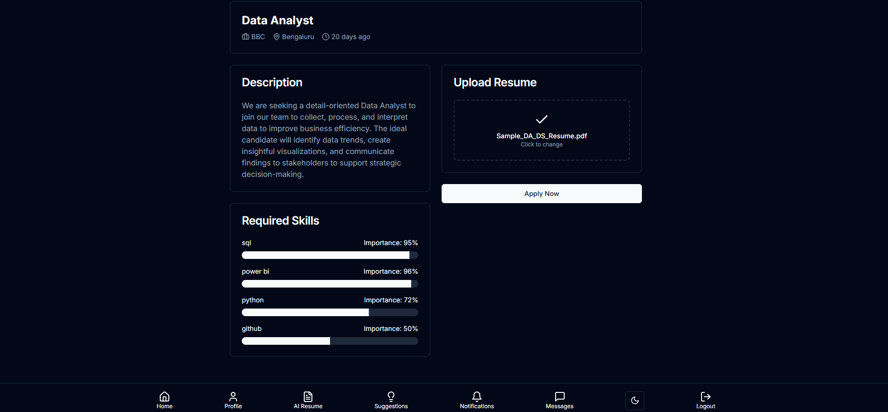

**Application Status Tracker:**

Each card shows current status (Pending / Accepted / Rejected), match score, and recruiter feedback.

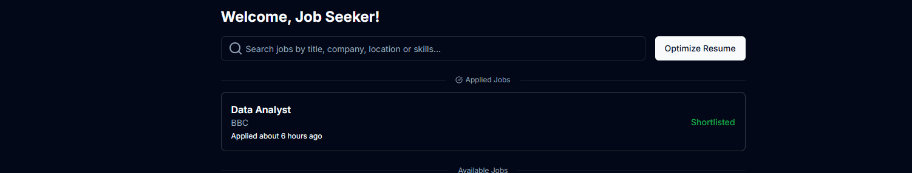

---

## 7. ATS Resume Analysis

The core AI feature. After a resume is uploaded, the system runs it through the ATS and Job Matching services powered by Google Gemini AI.

**ATS Analyzer:**
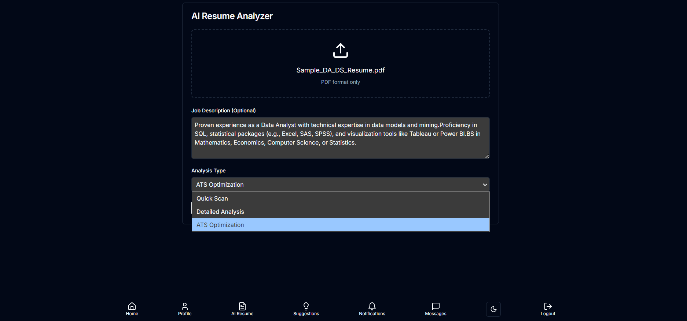

**ATS Score Overview:**
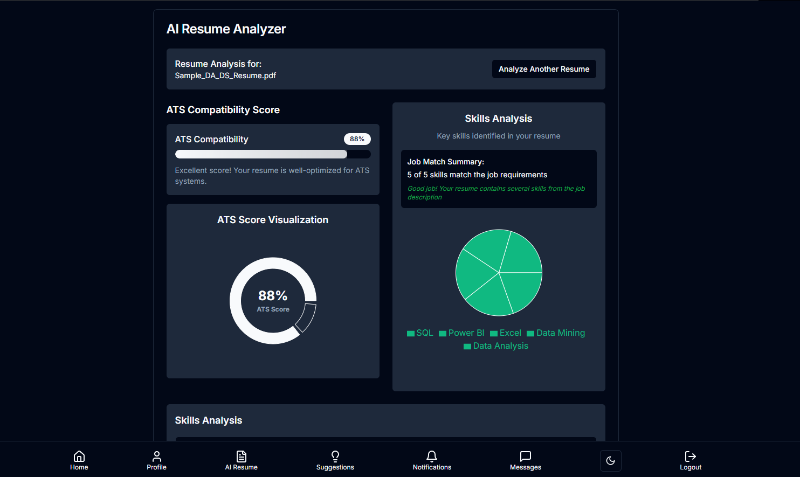

**Skill Match Breakdown:**

Visual breakdown of matched vs. missing skills with percentage weights.

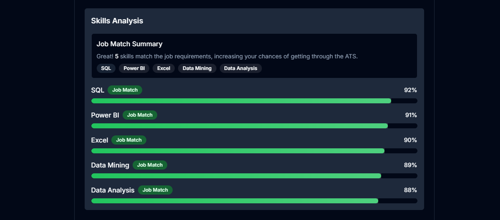

**Improvement Suggestions:**

The AI generates specific, actionable recommendations to improve the resume for the target role.

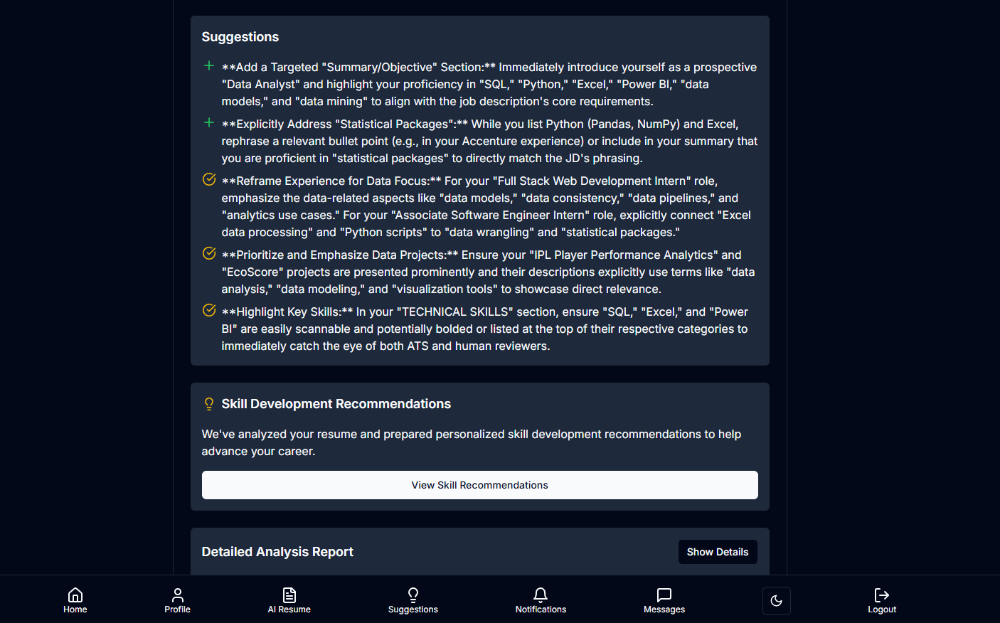

**Course Recommendations:**

Based on identified skill gaps, the system recommends learning resources to close them.

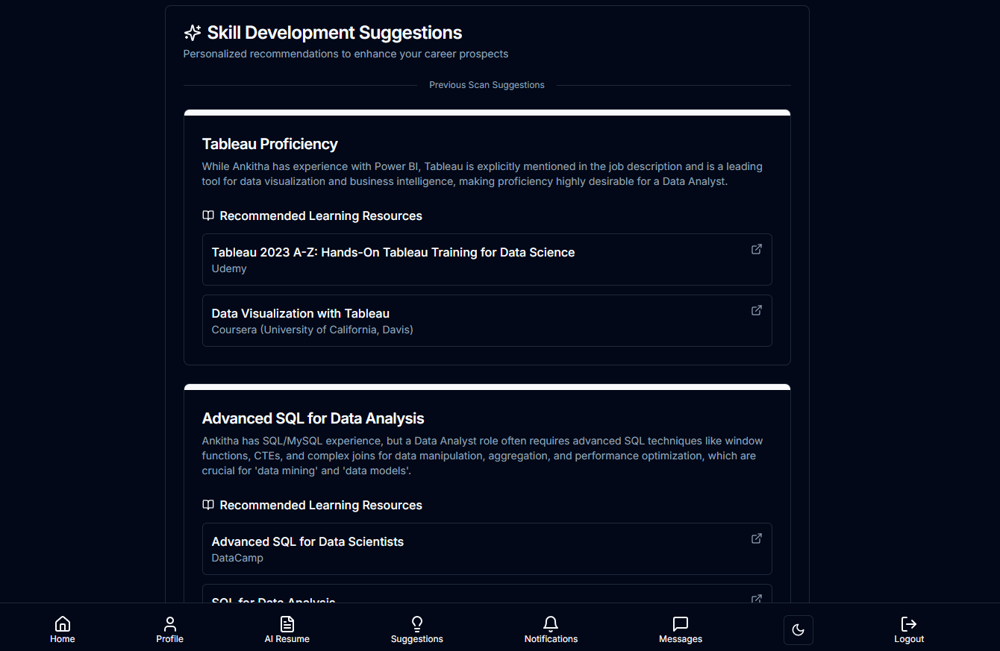

> *ATS score is out of 100 and accounts for keyword relevance, formatting quality, section completeness, and skill alignment with the job description.*

---

## 8. Notifications System

Both recruiters and applicants receive real-time notifications for key events — new applications, status changes, and new messages. Notifications are deduplicated and user-scoped.

**Recruiter Notifications:**
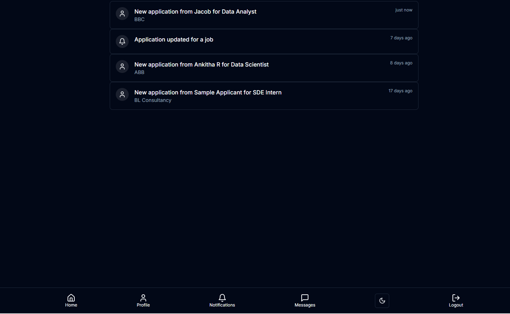

**Applicant Notifications:**
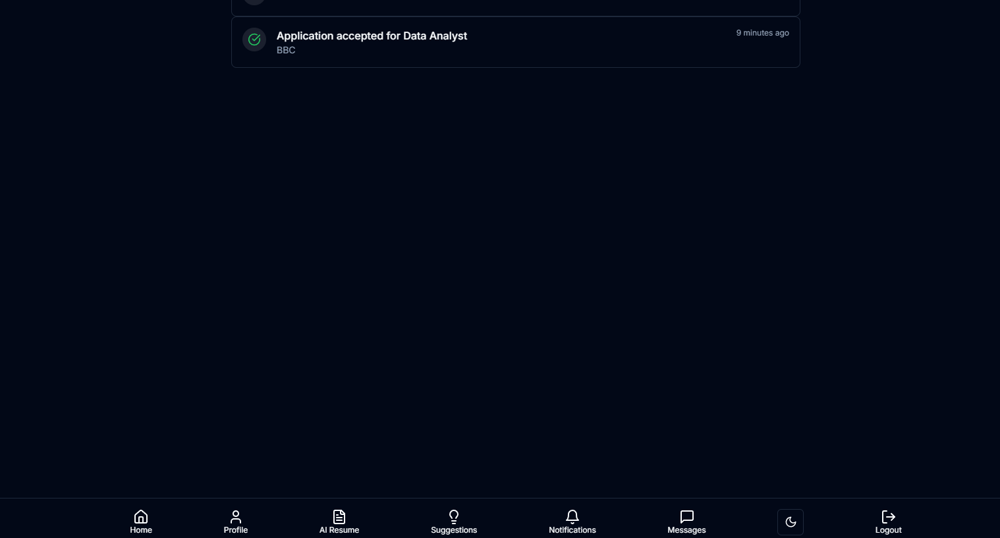

---

## 9. Messaging System

An in-platform messaging system connects recruiters and applicants, with conversation threads organized by job context.

**Conversations List:**
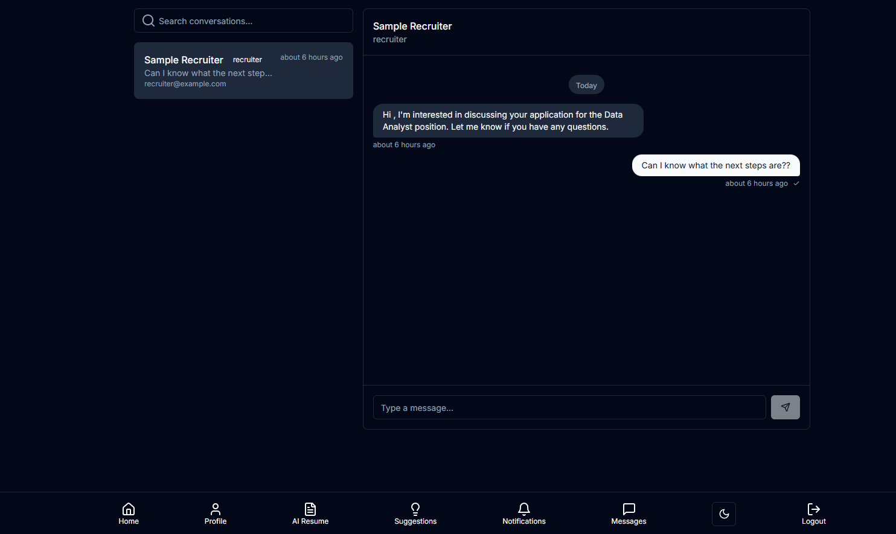

**Message Thread:**
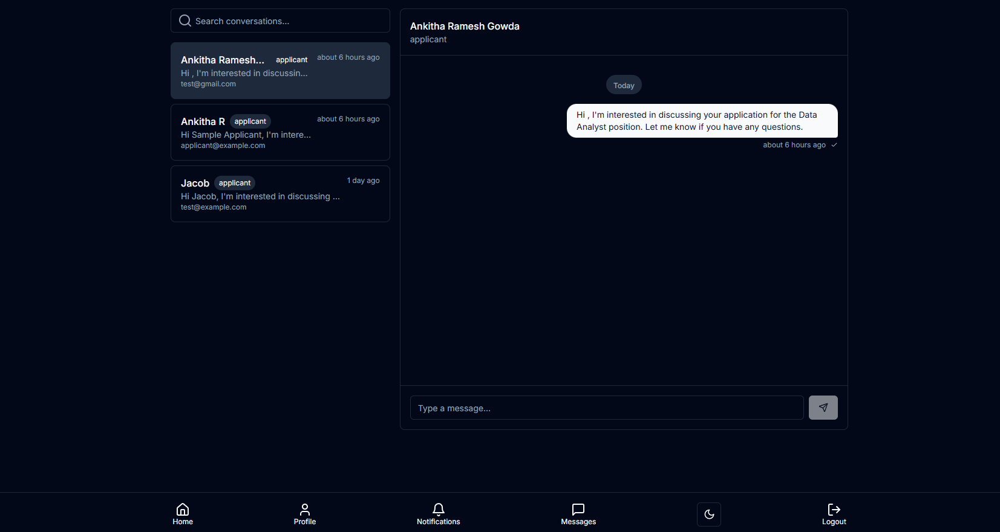

> *Messages are tied to a specific job, keeping communication organized when a recruiter manages multiple roles.*

---

## 10. ATS Reports

Full PDF reports are generated for ATS analysis sessions, suitable for sharing or archiving.

| Report | Description |
|---|---|
| [Sample ATS Report](./reports/ats-report-sample.pdf) | Example full ATS analysis report |

---

## Application Flow (End-to-End)

```
Applicant registers → Browses jobs → Uploads resume → Applies
        │
        ▼
ATS Service analyzes resume (Gemini AI)
        │
        ▼
Job Matching AI computes compatibility score
        │
        ▼
Recruiter receives notification → Reviews ranked candidates
        │
        ▼
Recruiter accepts or rejects → Automated feedback sent
        │
        ▼
Applicant receives notification with score + improvement tips
```

---

## Screenshots Index

| Screenshot File | Description |
|---|---|
| `screenshots/home.png` | Landing page |
| `screenshots/register.png` | Registration form |
| `screenshots/login.png` | Login screen |
| `screenshots/recruiter-dashboard.png` | Recruiter main dashboard |
| `screenshots/recruiter-application-review.png` | Application review panel |
| `screenshots/job-create.png` | Create job form |
| `screenshots/applicant-dashboard.png` | Applicant dashboard |
| `screenshots/applicant-profile.png` | Applicant profile page |
| `screenshots/apply-flow.png` | Resume upload + apply |
| `screenshots/applicant-application-status.png` | Application status view |
| `screenshots/ats-analyzer.png` | ATS analyzer screen |
| `screenshots/ats-score.png` | ATS score result |
| `screenshots/ats-skill-match.png` | Skill match chart |
| `screenshots/ats-suggestions.png` | AI improvement suggestions |
| `screenshots/ats-course-recommendations.png` | Course recommendations |
| `screenshots/notifications-recruiter.png` | Recruiter notifications |
| `screenshots/notifications-applicant.png` | Applicant notifications |
| `screenshots/messages-list.png` | Conversations list |
| `screenshots/messages-thread.png` | Message thread view |

---

*Back to [README.md](./README.md)*
